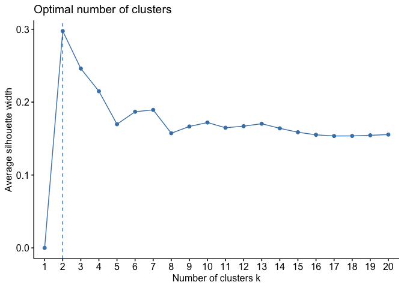
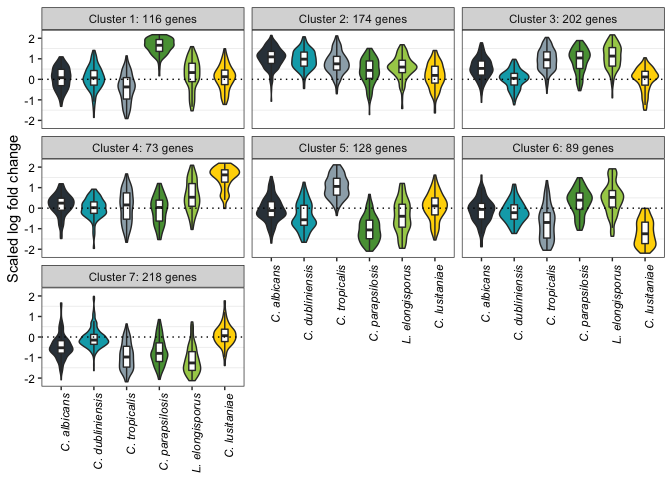
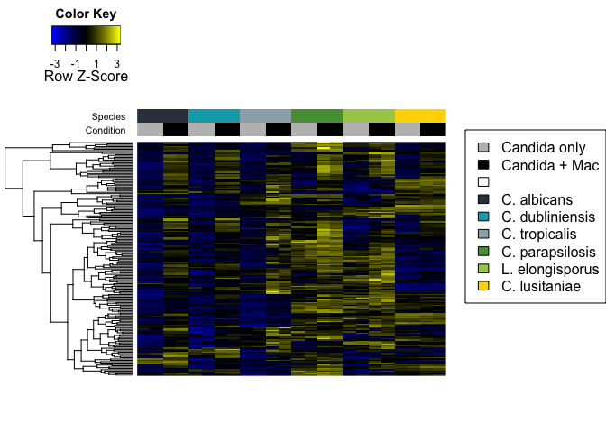
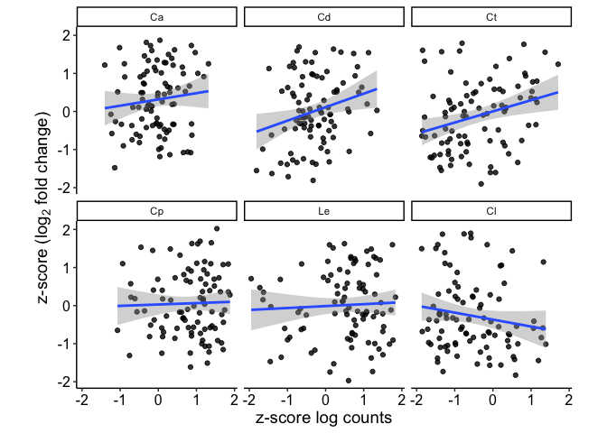
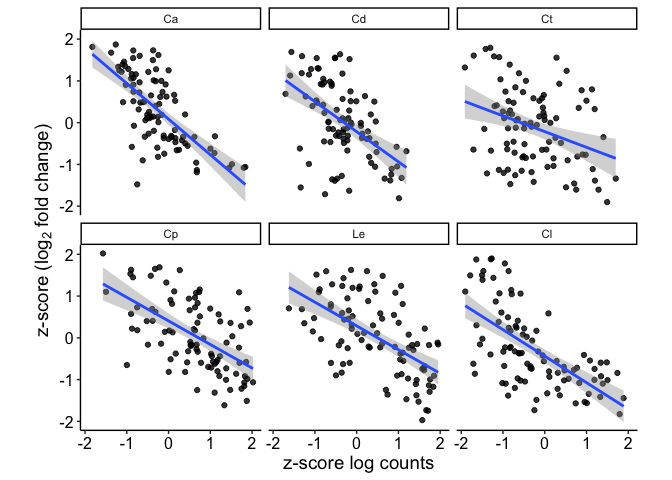
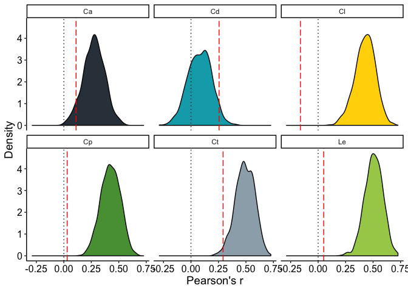
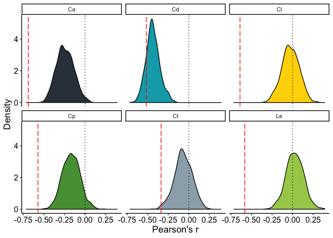

LFC clustering and comparison to absolute expression
================

We wanted to see differences in responses to phagocytosis across
species. Do do this, we identified genes with the highest variation in
log fold change in response to phagocytosis, then performed k-medoids
clustering (Figure 3 in the paper). However, upon comparison to absolute
expression, we found that differences in induction of core induced genes
reflected differences in baseline expression (Figure 4).

## LFC clustering of genes

To cluster genes by log fold changes across species, we first import
combined log fold change estimates and filter for genes with an average
of 10 counts in each species. We then get the 1,000 genes with the
highest variation in fold change, and use these to make a matrix of
z-scores:

``` r
library("matrixStats")
library("cluster")
library("factoextra")
library("ggplot2")
library("reshape2")
library("devtools")

df <- read.table("combined_LFCs_padj.txt", sep="\t", header=T)

# Filter for average baseMean > 10
base.means <- df[, c(grep("_baseMean", names(df)))]
rownames(base.means) <- df$Ca
good.genes <- rownames(base.means[apply(base.means, MARGIN=1, FUN=function(x) sum(x > 10)) == dim(base.means)[2],])

# Now make a matrix of LFCs and remove any genes below the inclusion threshold
mat <- as.matrix(df[,grep("_l2fc", names(df))])
rownames(mat) <- df$Ca
colnames(mat) <- gsub("_l2fc", "", colnames(mat))
mat <- mat[rownames(mat) %in% good.genes,]

# Pick out the 1,000 most variable genes
n <- 1000
rv <- rowVars(mat)
select <- order(rv, decreasing = TRUE)[seq_len(min(n, length(rv)))]

# Use these to make a matrix of LFCs scaled as z-scores:
scaled_mat <- t(scale(t(mat[select,]), center=F, scale=T))
```

We can check how much of the variance is captured by these genes:

``` r
total.var <- sum(rowVars(mat))
n.var <- sum(rowVars(mat[select,]))
print(paste("Percent of total genes: ", 100*n/nrow(mat), sep=""), quote=FALSE)
```

    ## [1] Percent of total genes: 23.4796900680911

``` r
print(paste("Percent of variance captured: ", 100*n.var/total.var, sep=""), quote=FALSE)
```

    ## [1] Percent of variance captured: 63.5167096807754

Now we can do clustering. To select the number of clusters, we can use
the Silhouette method. While this shows that two clusters gives the
highest score, there is a secondary peak at seven clusters, so this is
what we decided to use as it is likely to be more informative:

``` r
library(factoextra)
fviz_nbclust(scaled_mat, pam,"silhouette", k.max = 20)
```

<!-- -->

We then do the clustering and plot clusters as violin plots of scaled
LFC estimates across species:

``` r
# Set cluster number
nclust <- 7

# Do the clustering and extract clusters
kMedoids <- pam(scaled_mat, k=nclust, metric="euclidean")
cluster_df <- data.frame(gene=names(kMedoids$clustering), cluster=(kMedoids$clustering))

# Convert the scaled LFC data to long format and merge with the cluster information
melted <- as.data.frame(melt(scaled_mat))
names(melted) <- c("gene", "species", "LFC")
melted$species <- gsub("_l2fc", "", melted$species)
melted <- merge(melted, cluster_df, by="gene")                         
melted$species <- factor(melted$species, levels=c("Ca","Cd","Ct","Cp","Le","Cl"))

# Now plot the clusters
colorset <- c("#333f48", "#00a9b7", "#9cadb7", "#579d42", "#a6cd57", "#ffd600")
cluster_size <- table(kMedoids$clustering)
size_labels <- data.frame(cluster=names(cluster_size), label=paste("Cluster ", names(cluster_size), ": ", cluster_size, " genes", sep=""))
melted <- merge(melted, size_labels, by="cluster")
ggplot(melted, aes(species, LFC, fill=species)) +
  geom_violin() +
  geom_boxplot(width=0.2, fill="white", outlier.color="NA") +
  facet_wrap(~label) +
  scale_fill_manual(values=colorset) +
  theme_bw() +
  scale_x_discrete(labels=c("C. albicans", "C. dubliniensis", "C. tropicalis", "C. parapsilosis", "L. elongisporus", "C. lusitaniae")) +
  labs(y="Scaled log fold change") +
  geom_hline(yintercept=0, linetype="dotted") +
  theme(legend.position="none",
        axis.text=element_text(color="black"),
        axis.text.x=element_text(angle=90, face="italic", hjust=1),
        axis.title.x=element_blank(),
        panel.grid.major=element_blank())
```

<!-- -->

This shows a number of different cluster patterns as described in the
paper. In particular, cluster 2 shows genes that are more highly induced
in *C. albicans*, *C. dubliniensis*, and *C. tropicalis*. GO term
enrichment analysis shows that many of these genes are involved in
alternative carbon metabolism.

### Comparison to absolute expression levels

However, LFC estimates alone only tell part of the story. We also want
to know how this relates to relative absolute expression upon
phagocytosis across species. We can visualize this for individual
clusters across species using a heatmap. For this, we need to import our
regularized log-transformed counts, and we will use the heatmap.3
function written by Obi Griffith:

``` r
source_url("https://raw.githubusercontent.com/obigriffith/biostar-tutorials/master/Heatmaps/heatmap.3.R")
```

    ## SHA-1 hash of file is 015fc0457e61e3e93a903e69a24d96d2dac7b9fb

``` r
cluster_number <- 2
gene_counts <- read.table("all_rlog_counts.txt", header=T, sep="\t")
gene_counts <- gene_counts[good.genes,] # Include only the genes you have been working with for LFC analysis
scaled_counts <- t(scale(t(as.matrix(gene_counts)), scale=F, center=T))
scaled_counts <- scaled_counts[, c("Ca_only_1", "Ca_only_2", "Ca_mouse_1", "Ca_mouse_2", "Cd_only_1", "Cd_only_2", "Cd_mouse_1", "Cd_mouse_2",
                                   "Ct_only_1", "Ct_only_2", "Ct_mouse_1", "Ct_mouse_2", "Cp_only_1", "Cp_only_2", "Cp_mouse_1", "Cp_mouse_2",
                                   "Le_only_1", "Le_only_2", "Le_mouse_1", "Le_mouse_2", "Cl_only_1", "Cl_only_2", "Cl_mouse_1", "Cl_mouse_2")] # Re-ordering the columns
cluster_counts <- scaled_counts[names(kMedoids$clustering)[kMedoids$clustering == cluster_number],]
hc_counts <- hclust(dist(cluster_counts, method="euclidean"), method="complete")
hcd_counts <- as.dendrogram(hc_counts)
color_scale <- colorRampPalette(c("blue", "black", "yellow"))
ColLab <- cbind(rep(c("grey", "black"), each=2, times=6), rep(colorset, each=4))
colnames(ColLab) <- c("Condition", "Species")
par(oma = c(0, 0, 0, 9))
heatmap.3(cluster_counts, scale="row",
          col=color_scale(100), trace="none",
          Colv="none", dendrogram="row", labRow=F,
          KeyValueName=NA,
          ColSideColors=ColLab, ColSideColorsSize=3,
          labCol=NA, margins=c(5,5), bty='L'
)
par(oma = c(0, 0, 0, 0), mar = c(0, 0, 0, 0), new = TRUE)
plot(0, 0, type = "n", bty = "n", xaxt = "n", yaxt = "n")
legend("right", legend=c("Candida only", "Candida + Mac", "", "C. albicans",
                            "C. dubliniensis", "C. tropicalis", "C. parapsilosis",
                            "L. elongisporus", "C. lusitaniae"),
       fill=c("grey", "black", "white", colorset))
```

<!-- -->

What is clear from this is that although *C. albicans* and its relatives
are showing the strongest responses to phagocytosis in these genes, this
does not necessarily translate to higher levels of gene expression.
Indeed, in many cases, *C. parapsilosis* and *L. elongisporus* show
higher absolute expression levels inside macrophages.

One possible reason for this is that many of the cluster 2 genes are
related to alternative carbon metabolism, which means that they are
subject to glucose-mediated repression by Mig1/Mig2. Therefore,
differences in induction upon phagocytosis may more closely reflect
differences in the degree of repression by glucose outside the
phagolysosome.

### The relationship between LFC and absolute expression in core induced genes

The same may also be true for our core induced gene set. We wanted to
test this by looking at the relationship between LFC and absolute
expression in both macrophages and in *Candida*-only samples. First,
construct tables with regularized log-transformed counts and LFCs:

``` r
core_genes <- scan("core_induced_genes.txt", what="character", sep="\n")

# Get core LFCs and reformat
lfcs_scaled <- as.data.frame(t(scale(t(mat))))
lfcs_scaled$gene <- rownames(lfcs_scaled)
scaled_lfcs_melt <- melt(lfcs_scaled, id.vars="gene")
scaled_lfcs_melt$species <- gsub("_l2fc", "", scaled_lfcs_melt$variable)

# Now process the counts data frame to get mean counts for each species
copy_counts <- gene_counts
copy_counts$gene <- rownames(copy_counts)
melt_counts <- melt(copy_counts, id.vars="gene")
melt_counts$group <- gsub("_[12]", "", melt_counts$variable)
mean_counts <- aggregate(melt_counts$value, by=list(melt_counts$gene, melt_counts$group), FUN="mean")
mean_counts_mat <- dcast(mean_counts, Group.1 ~ Group.2)
```

    ## Using x as value column: use value.var to override.

``` r
rownames(mean_counts_mat) <- mean_counts_mat$Group.1
mean_counts_mat <- mean_counts_mat[,-1]
```

Now we compare the two. The key is that we want to get relative
expression in each species within a given condition. Therefore, we scale
the abundance estimates *after* separating out the conditions to get
z-scores that are centered around the mean expression for that
condition. First, do counts in macrophage:

``` r
scaled_mean_counts_mac <- as.data.frame(t(scale(t(mean_counts_mat[,grep("mouse", colnames(mean_counts_mat))]), center=T, scale=T)))
scaled_mean_counts_mac$gene <- rownames(scaled_mean_counts_mac)
scaled_mean_counts_mac_melt <- melt(scaled_mean_counts_mac, id.vars="gene")
scaled_mean_counts_mac_melt$species <- gsub("_.+", "", scaled_mean_counts_mac_melt$variable)

mac_combined <- merge(scaled_mean_counts_mac_melt, scaled_lfcs_melt, by=c("gene", "species"))
mac_combined$species <- factor(mac_combined$species, levels=c("Ca", "Cd", "Ct", "Cp", "Le", "Cl"))

mac_combined_core <- mac_combined[mac_combined$gene %in% core_genes,]

# Get correlations and p-values for significance (linear model)
mac_cor_df <- as.data.frame(cbind(
  as.matrix(by(mac_combined_core[,c("value.x", "value.y")], mac_combined_core$species,
               function(x) {cor(x$value.x, x$value.y, method="pearson")})),
  as.matrix(by(mac_combined_core[,c("value.x", "value.y")], mac_combined_core$species,
               function(x) {summary(lm(x$value.y ~ x$value.x))$coefficients[2,4]}))))
names(mac_cor_df) <- c("r", "p")

print(mac_cor_df)
```

    ##              r           p
    ## Ca  0.11128388 0.290928130
    ## Cd  0.25586420 0.013826726
    ## Ct  0.29223774 0.004702946
    ## Cp  0.03032848 0.774120561
    ## Le  0.05088414 0.630017200
    ## Cl -0.16092733 0.125408241

``` r
# Plot correlations
ggplot(mac_combined_core, aes(x=value.x, y=value.y)) +
  geom_point(alpha=0.8) +
  labs(y=expression(paste("z-score (", log[2], " fold change)")), x="z-score log counts") +
  geom_smooth(method="lm") +
  theme_classic() +
  theme(axis.text=element_text(color="black", size=12), axis.title=element_text(size=14)) +
  facet_wrap(~species) +
  coord_fixed()
```

<!-- -->

We can see that correlations on the whole between counts inside a
macrophage and log fold change are very weak. What about comparing the
degree of induction with expression in *Candida*-only condition:

``` r
scaled_mean_counts_only <- as.data.frame(t(scale(t(mean_counts_mat[,grep("only", colnames(mean_counts_mat))]), center=T, scale=T)))
scaled_mean_counts_only$gene <- rownames(scaled_mean_counts_only)
scaled_mean_counts_only_melt <- melt(scaled_mean_counts_only, id.vars="gene")
scaled_mean_counts_only_melt$species <- gsub("_.+", "", scaled_mean_counts_only_melt$variable)

only_combined <- merge(scaled_mean_counts_only_melt, scaled_lfcs_melt, by=c("gene", "species"))
only_combined$species <- factor(only_combined$species, levels=c("Ca", "Cd", "Ct", "Cp", "Le", "Cl"))

only_combined_core <- only_combined[only_combined$gene %in% core_genes,]

# Get correlations and p-values for significance (linear model)
only_cor_df <- as.data.frame(cbind(
  as.matrix(by(only_combined_core[,c("value.x", "value.y")], only_combined_core$species,
               function(x) {cor(x$value.x, x$value.y, method="pearson")})),
  as.matrix(by(only_combined_core[,c("value.x", "value.y")], only_combined_core$species,
               function(x) {summary(lm(x$value.y ~ x$value.x))$coefficients[2,4]}))))
names(only_cor_df) <- c("r", "p")

print(only_cor_df)
```

    ##             r            p
    ## Ca -0.6897523 2.875961e-14
    ## Cd -0.5166285 1.350556e-07
    ## Ct -0.3375389 1.000364e-03
    ## Cp -0.5728049 2.426422e-09
    ## Le -0.5813828 1.226802e-09
    ## Cl -0.6393740 6.908000e-12

``` r
# Plot correlations
ggplot(only_combined_core, aes(x=value.x, y=value.y)) +
  geom_point(alpha=0.8) +
  labs(y=expression(paste("z-score (", log[2], " fold change)")), x="z-score log counts") +
  geom_smooth(method="lm") +
  theme_classic() +
  theme(axis.text=element_text(color="black", size=12), axis.title=element_text(size=14)) +
  facet_wrap(~species) +
  coord_fixed()
```

<!-- -->

Now we can see that there is a much stronger, negative correlation
between the degree of induction and absolute counts outside the
macrophage. This implies that there is convergence of expression levels
upon phagocytosis. However, we would like to check whether this is a
specific feature of these genes or a general feature of the dataset. For
that, we can choose random sets of the same number of genes and
calculate correlations in each case. Let’s do this first for expression
levels inside a macrophage:

``` r
# Generate correlation data for random gene sets and store these in a list
random_output <- list()
n_reps <- 1000 # We used 10,000 in the paper, but here we use 1,000 for the sake of brevity
for (i in 1:n_reps) {
  random_genes <- sample(row.names(gene_counts), length(core_genes))
  random_set <- mac_combined[mac_combined$gene %in% random_genes,]
  # Get correlations for each species
  cor_df <- as.data.frame(cbind(
    as.matrix(by(random_set[,c("value.x", "value.y")], random_set$species,
                 function(x) {cor(x$value.x, x$value.y, method="pearson")})),
    as.matrix(by(random_set[,c("value.x", "value.y")], random_set$species,
                 function(x) {summary(lm(x$value.y ~ x$value.x))$coefficients[2,4]}))
    )
    )
  names(cor_df) <- c("r", "p")
  cor_df$i <- i
  cor_df$species <- rownames(cor_df)
  random_output[[i]] <- cor_df
}

# Combine the list into a dataframe and do density plots for each:
output_df <- do.call("rbind", random_output)
output_df$species <- factor(output_df$species, levels=c("Ca", "Cd", "Ct", "Cp", "Le", "Cl"))
colorset <- c("#333f48", "#00a9b7", "#9cadb7", "#579d42", "#a6cd57", "#ffd600")
mac_cor_df$species <- rownames(mac_cor_df)
ggplot(na.omit(output_df), aes(x=r, fill=species)) +
  geom_density() +
  facet_wrap(~species) +
  scale_fill_manual(values=colorset) +
  geom_vline(xintercept=0, linetype="dotted") +
  geom_vline(data=mac_cor_df, aes(xintercept=r), linetype="longdash", color="red") +
  theme_classic() +
  theme(axis.text=element_text(size=12, color="black"),
        axis.title=element_text(size=14), legend.position="none") +
  labs(x="Pearson's r", y="Density")
```

<!-- -->

What we can see here is that on average among randomly selected genes,
there is a moderately positive correlation between the degree of
phagocytosis-mediated induction (LFC) and the expression inside
macrophages. This is presumably to be expected: stronger induction leads
to higher expression. However, with the exception of *C. dubliniensis*,
these correlations are much weaker for the core induced genes (dotted
red lines). Next, we look at expression levels in the *Candida*-only
condition:

``` r
# Generate correlation data for random gene sets and store these in a list
random_output <- list()
n_reps <- 1000 # We used 10,000 in the paper, but here we use 1,000 for the sake of brevity
for (i in 1:n_reps) {
  random_genes <- sample(row.names(gene_counts), length(core_genes))
  random_set <- only_combined[only_combined$gene %in% random_genes,]
  # Get correlations for each species
  cor_df <- as.data.frame(cbind(
    as.matrix(by(random_set[,c("value.x", "value.y")], random_set$species,
                 function(x) {cor(x$value.x, x$value.y, method="pearson")})),
    as.matrix(by(random_set[,c("value.x", "value.y")], random_set$species,
                 function(x) {summary(lm(x$value.y ~ x$value.x))$coefficients[2,4]}))
    )
    )
  names(cor_df) <- c("r", "p")
  cor_df$i <- i
  cor_df$species <- rownames(cor_df)
  random_output[[i]] <- cor_df
}

# Combine the list into a dataframe and do density plots for each:
output_df <- do.call("rbind", random_output)
output_df$species <- factor(output_df$species, levels=c("Ca", "Cd", "Ct", "Cp", "Le", "Cl"))
colorset <- c("#333f48", "#00a9b7", "#9cadb7", "#579d42", "#a6cd57", "#ffd600")
only_cor_df$species <- rownames(only_cor_df)
ggplot(na.omit(output_df), aes(x=r, fill=species)) +
  geom_density() +
  facet_wrap(~species) +
  scale_fill_manual(values=colorset) +
  geom_vline(xintercept=0, linetype="dotted") +
  geom_vline(data=only_cor_df, aes(xintercept=r), linetype="longdash", color="red") +
  theme_classic() +
  theme(axis.text=element_text(size=12, color="black"),
        axis.title=element_text(size=14), legend.position="none") +
  labs(x="Pearson's r", y="Density")
```

<!-- -->

Now we see that there is a negative correlation between induction and
pre-phagocytosis expression, as again we might expect. Crucially,
however, this correlation is much more negative for core induced genes
(dotted red lines) than randomly selected genes. The one exception to
this seems to be *C. dubliniensis*, which actually shows a particularly
strong negative correlation between the two for randomly selected genes.
Even in this case, however, core induced genes show a stronger negative
correlation than average.

Therefore, the lack of positive correlation between degree of induction
and post-phagocytosis expression, as well as the strength of negative
correlation between degree of induction and pre-phagocytosis expression,
appear to be particular features of this core induced gene set.
