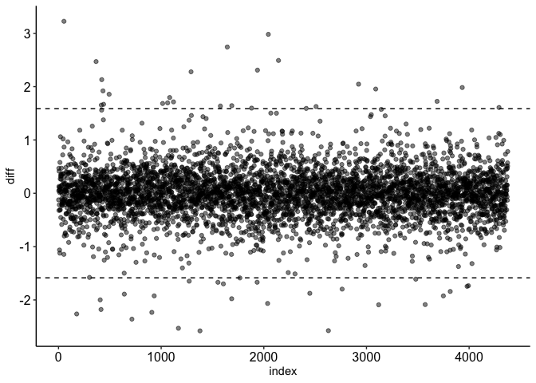
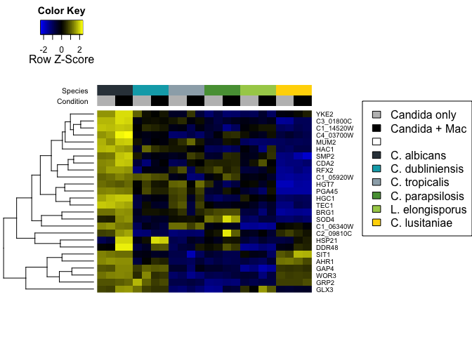
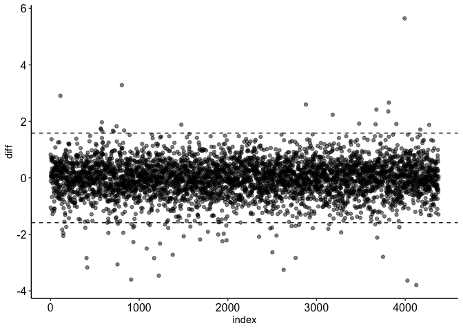
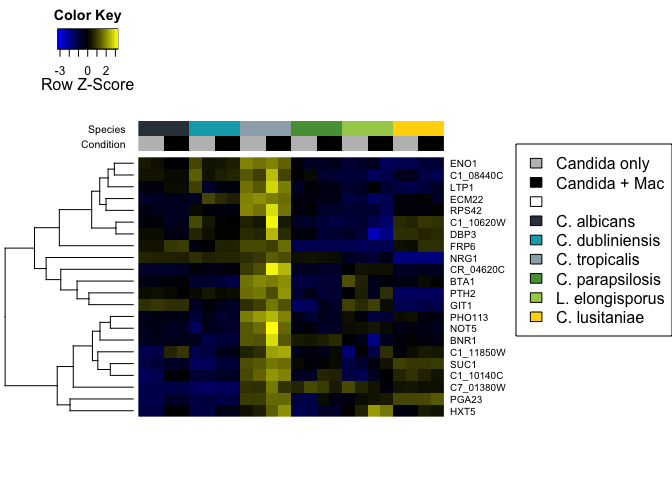
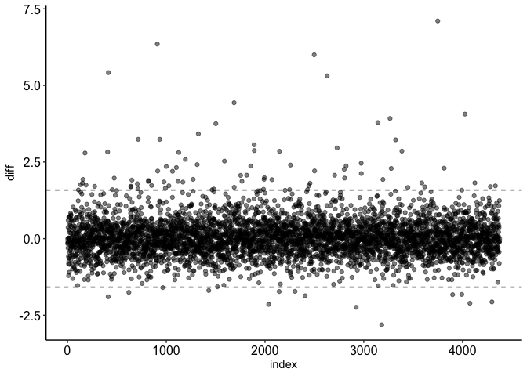
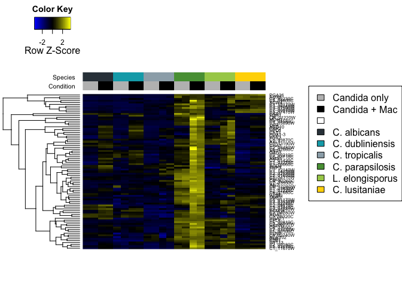

Absolute ratio comparison
================

We wanted to look at genes that had particularly high expression in one
species compared to the others. For this, we compare the expression in
macrophages in individual genes to the mean expression across species.
Let’s do this first for *C. albicans*, as in Figure 5 of the paper. Note
that as the counts are log-transformed, in order to get a ratio we take
the arithmetic difference between the two:

``` r
library("ggplot2")
library("devtools")

# Load in counts
df <- read.table("all_rlog_counts.txt", header=T,sep="\t")
df.mac <- df[, grep("mouse", names(df))]

# Calculate the means for C. albicans vs the rest
species <- "Ca"
means <- data.frame(gene=rownames(df.mac),
                    species=rowMeans(df.mac[, grep(species, names(df.mac))]),
                    other=rowMeans(df.mac[, grep(species, names(df.mac), invert=T)]))
means$diff <- means$species - means$other
means$index <- seq(nrow(means))

# Plot the ratio of the two
threshold <- log2(3)

ggplot(means, aes(x=index, y=diff)) +
  geom_point(alpha=0.5) +
  geom_hline(yintercept=threshold, linetype="dashed") +
  geom_hline(yintercept=-threshold, linetype="dashed") +
  theme_classic() +
  theme(axis.text=element_text(size=12, color="black"))
```

<!-- -->

Now, to visualize how expression varies across different conditions and
species, we can plot a heatmap. For this, I am going to use the actual
gene names as in the paper. To do this, we need to import annotations of
gene names:

``` r
# Import gene name annotations
annotations <- read.table("c_albicans_gene_info.txt", header=T, sep="\t", quote="", comment.char="")[,c(1,3,4)]
annotations$Gene.ID <- gsub("_A|_B", "", annotations$Gene.ID)
annotations$Gene.Name.or.Symbol <- as.character(annotations$Gene.Name.or.Symbol)
annotations$Gene.Name.or.Symbol[annotations$Gene.Name.or.Symbol == "N/A"] <- annotations$Gene.ID[annotations$Gene.Name.or.Symbol == "N/A"]

# Identify genes with higher expression in C. albicans
ups <- as.character(means$gene[means$diff > threshold])

# Plot heatmap
source_url("https://raw.githubusercontent.com/obigriffith/biostar-tutorials/master/Heatmaps/heatmap.3.R") # Again, using Obi Griffith's Heatmap 3 function
```

    ## SHA-1 hash of file is 015fc0457e61e3e93a903e69a24d96d2dac7b9fb

``` r
colorset <- c("#333f48", "#00a9b7", "#9cadb7", "#579d42", "#a6cd57", "#ffd600")
mat <- as.matrix(df[rownames(df) %in% ups,])
rownames(mat) <- annotations$Gene.Name.or.Symbol[match(ups, annotations$Gene.ID)] # Convert annotations to gene IDs
scaled_counts <- t(scale(t(as.matrix(mat)), scale=F, center=T))
scaled_counts <- scaled_counts[, c("Ca_only_1", "Ca_only_2", "Ca_mouse_1", "Ca_mouse_2", "Cd_only_1", "Cd_only_2", "Cd_mouse_1", "Cd_mouse_2",
                                   "Ct_only_1", "Ct_only_2", "Ct_mouse_1", "Ct_mouse_2", "Cp_only_1", "Cp_only_2", "Cp_mouse_1", "Cp_mouse_2",
                                   "Le_only_1", "Le_only_2", "Le_mouse_1", "Le_mouse_2", "Cl_only_1", "Cl_only_2", "Cl_mouse_1", "Cl_mouse_2")]
hc_counts <- hclust(dist(scaled_counts, method="euclidean"), method="complete")
hcd_counts <- as.dendrogram(hc_counts)
color_scale <- colorRampPalette(c("blue", "black", "yellow"))
ColLab <- cbind(rep(c("grey", "black"), each=2, times=6), rep(colorset, each=4))
colnames(ColLab) <- c("Condition", "Species")
par(oma = c(0, 0, 0, 13))
heatmap.3(scaled_counts, scale="row",
          col=color_scale(100), trace="none",
          Colv="none", dendrogram="row",
          KeyValueName=NA,
          ColSideColors=ColLab, ColSideColorsSize=3,
          labCol=NA, margins=c(5,5)
)
par(oma = c(0, 0, 0, 0), mar = c(0, 0, 0, 0), new = TRUE)
plot(0, 0, type = "n", bty = "n", xaxt = "n", yaxt = "n")
legend("right", legend=c("Candida only", "Candida + Mac", "", "C. albicans",
                            "C. dubliniensis", "C. tropicalis", "C. parapsilosis",
                            "L. elongisporus", "C. lusitaniae"),
       fill=c("grey", "black", "white", colorset))
```

<!-- -->

As described in the paper, many of these genes are involved in hypha or
biofilm formation, highlighting the important and distinguishing role of
this trait in *C. albicans*. However, most of them are not induced in
response to phagocytosis.

We can do this for other species too. First we repeat the analysis for
*C. tropicalis* (note that for the sake of convenience we are continuing
to use the *C. albicans* gene IDs):

``` r
# Calculate the means for C. tropicalis vs the rest
species <- "Ct"
means <- data.frame(gene=rownames(df.mac),
                    species=rowMeans(df.mac[, grep(species, names(df.mac))]),
                    other=rowMeans(df.mac[, grep(species, names(df.mac), invert=T)]))
means$diff <- means$species - means$other
means$index <- seq(nrow(means))

# Plot the ratio of the two
threshold <- log2(3)

ggplot(means, aes(x=index, y=diff)) +
  geom_point(alpha=0.5) +
  geom_hline(yintercept=threshold, linetype="dashed") +
  geom_hline(yintercept=-threshold, linetype="dashed") +
  theme_classic() +
  theme(axis.text=element_text(size=12, color="black"))
```

<!-- -->

``` r
# Now plot heatmap
ups <- as.character(means$gene[means$diff > threshold])

mat <- as.matrix(df[rownames(df) %in% ups,])
rownames(mat) <- annotations$Gene.Name.or.Symbol[match(ups, annotations$Gene.ID)] # Convert annotations to gene IDs
scaled_counts <- t(scale(t(as.matrix(mat)), scale=F, center=T))
scaled_counts <- scaled_counts[, c("Ca_only_1", "Ca_only_2", "Ca_mouse_1", "Ca_mouse_2", "Cd_only_1", "Cd_only_2", "Cd_mouse_1", "Cd_mouse_2",
                                   "Ct_only_1", "Ct_only_2", "Ct_mouse_1", "Ct_mouse_2", "Cp_only_1", "Cp_only_2", "Cp_mouse_1", "Cp_mouse_2",
                                   "Le_only_1", "Le_only_2", "Le_mouse_1", "Le_mouse_2", "Cl_only_1", "Cl_only_2", "Cl_mouse_1", "Cl_mouse_2")]
hc_counts <- hclust(dist(scaled_counts, method="euclidean"), method="complete")
hcd_counts <- as.dendrogram(hc_counts)
color_scale <- colorRampPalette(c("blue", "black", "yellow"))
ColLab <- cbind(rep(c("grey", "black"), each=2, times=6), rep(colorset, each=4))
colnames(ColLab) <- c("Condition", "Species")
par(oma = c(0, 0, 0, 13))
heatmap.3(scaled_counts, scale="row",
          col=color_scale(100), trace="none",
          Colv="none", dendrogram="row",
          KeyValueName=NA,
          ColSideColors=ColLab, ColSideColorsSize=3,
          labCol=NA, margins=c(5,5)
)
par(oma = c(0, 0, 0, 0), mar = c(0, 0, 0, 0), new = TRUE)
plot(0, 0, type = "n", bty = "n", xaxt = "n", yaxt = "n")
legend("right", legend=c("Candida only", "Candida + Mac", "", "C. albicans",
                            "C. dubliniensis", "C. tropicalis", "C. parapsilosis",
                            "L. elongisporus", "C. lusitaniae"),
       fill=c("grey", "black", "white", colorset))
```

<!-- -->

Again, we see a relatively small number of genes that have at least
threefold higher expression in *C. tropicalis* than the mean of other
species. Finally, we can do this for *C. parapsilosis*:

``` r
# Calculate the means for C. tropicalis vs the rest
species <- "Cp"
means <- data.frame(gene=rownames(df.mac),
                    species=rowMeans(df.mac[, grep(species, names(df.mac))]),
                    other=rowMeans(df.mac[, grep(species, names(df.mac), invert=T)]))
means$diff <- means$species - means$other
means$index <- seq(nrow(means))

# Plot the ratio of the two
threshold <- log2(3)

ggplot(means, aes(x=index, y=diff)) +
  geom_point(alpha=0.5) +
  geom_hline(yintercept=threshold, linetype="dashed") +
  geom_hline(yintercept=-threshold, linetype="dashed") +
  theme_classic() +
  theme(axis.text=element_text(size=12, color="black"))
```

<!-- -->

``` r
# Now plot heatmap
ups <- as.character(means$gene[means$diff > threshold])

mat <- as.matrix(df[rownames(df) %in% ups,])
rownames(mat) <- annotations$Gene.Name.or.Symbol[match(ups, annotations$Gene.ID)] # Convert annotations to gene IDs
scaled_counts <- t(scale(t(as.matrix(mat)), scale=F, center=T))
scaled_counts <- scaled_counts[, c("Ca_only_1", "Ca_only_2", "Ca_mouse_1", "Ca_mouse_2", "Cd_only_1", "Cd_only_2", "Cd_mouse_1", "Cd_mouse_2",
                                   "Ct_only_1", "Ct_only_2", "Ct_mouse_1", "Ct_mouse_2", "Cp_only_1", "Cp_only_2", "Cp_mouse_1", "Cp_mouse_2",
                                   "Le_only_1", "Le_only_2", "Le_mouse_1", "Le_mouse_2", "Cl_only_1", "Cl_only_2", "Cl_mouse_1", "Cl_mouse_2")]
hc_counts <- hclust(dist(scaled_counts, method="euclidean"), method="complete")
hcd_counts <- as.dendrogram(hc_counts)
color_scale <- colorRampPalette(c("blue", "black", "yellow"))
ColLab <- cbind(rep(c("grey", "black"), each=2, times=6), rep(colorset, each=4))
colnames(ColLab) <- c("Condition", "Species")
par(oma = c(0, 0, 0, 13))
heatmap.3(scaled_counts, scale="row",
          col=color_scale(100), trace="none",
          Colv="none", dendrogram="row",
          KeyValueName=NA,
          ColSideColors=ColLab, ColSideColorsSize=3,
          labCol=NA, margins=c(5,5)
)
par(oma = c(0, 0, 0, 0), mar = c(0, 0, 0, 0), new = TRUE)
plot(0, 0, type = "n", bty = "n", xaxt = "n", yaxt = "n")
legend("right", legend=c("Candida only", "Candida + Mac", "", "C. albicans",
                            "C. dubliniensis", "C. tropicalis", "C. parapsilosis",
                            "L. elongisporus", "C. lusitaniae"),
       fill=c("grey", "black", "white", colorset))
```

<!-- -->

As we can see here, *C. parapsilosis* has more genes with higher
expression than other species. Interestingly, in contrast to *C.
albicans* and *C. tropicalis*, many of these genes do appear to be
phagocytosis-induced. Inspection of individual genes suggest that a lot
of these relate to alternative carbon metabolism, particularly fatty
acid metabolism. Many of these are still induced in other species, but
interestingly *C. parapsilosis* appears to induce them to a higher
level.
