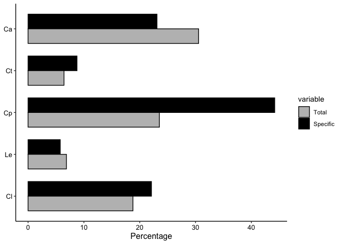
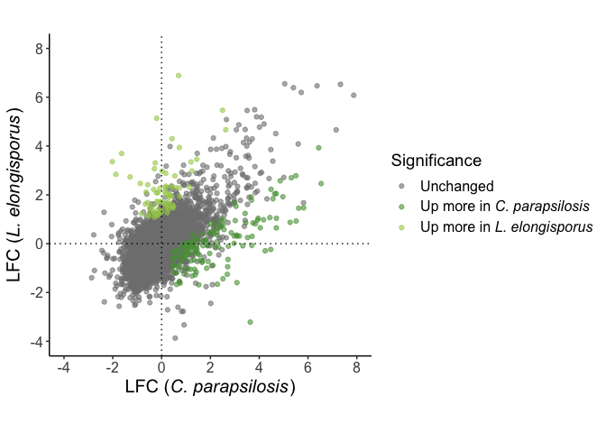
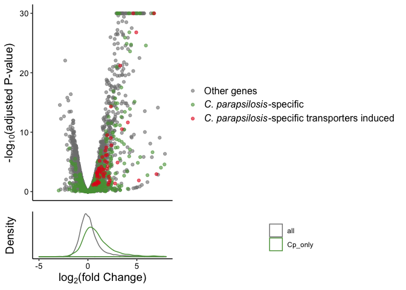

*C. parapsilosis* analysis
================

*Candida parapsilosis* is an organism that is a frequent cause of
infection, particularly in neonatal patients. However, compared to *C.
albicans*, it does not possess certain virulence traits such as hyphae
formation and is less virulent in mouse models. Therefore, factors
making this such a prevalent species are unclear.

The following code was used to generate Figure 6 in the paper.

## Phagocytosis-mediated induction in species-specific genes

One way in which certain species may show increased responsiveness to
phagocytosis is through the regulation of species-specific genes. We
investigated whether species-specific gene subsets show an enrichment of
phagocytosis-induced genes relative to the general population of genes
in that species. The first thing we need to do is identify
species-specific gene subsets. We then calculate the fraction that are
or aren’t phagocytosis induced and perform a hypergeometric test to look
for enrichment. We do this for each species through the following
function:

``` r
library("ggplot2")
library("reshape2")
library("dplyr")
library("tximport")
library("DESeq2")
library("cowplot")

species_list <- c("Ca", "Ct", "Cp", "Le", "Cl") # Note that we drop C. dubliniensis as it shares almost all genes with C. albicans

# Import and process CGOB file for analysis across orthologs
CGOB <- read.table("CGOB_headed.txt", sep="\t",header=T, na.strings="---", quote = "")
names(CGOB)[names(CGOB) == "Ca"] <- "Ca_orf19" # This is because I'm going to use the header Ca for Assembly 22 IDs
A22_to_orf19 <- read.table("A22_to_orf19.txt", sep="\t",header=T)
CGOB <- merge(CGOB,A22_to_orf19[,c("ORF19_ID","ASSEMBLY22_ID")],by.x="Ca_orf19",by.y="ORF19_ID",all.x=T,all.y=F)
names(CGOB)[names(CGOB) == "ASSEMBLY22_ID"] <- "Ca"
CGOB <- CGOB[, names(CGOB) != "Ca_orf19"]
CGOB$Ca <- gsub("_A", "", CGOB$Ca)
CGOB <- CGOB[, species_list]

get_species_specific_enrichment <- function(species) {
  allowed <- species
  not_allowed  <- setdiff(species_list, allowed)
  
  # Import data on induced genes
  pairwise <- read.table(paste("fold_changes/", species, "_pairwise.txt", sep=""),
                             header=T, sep="\t")
  induced <- rownames(na.omit(pairwise[pairwise$log2FoldChange > 0 & pairwise$padj < 0.1,]))
  
  # Define genes specific to the allowed species
  # Here we look for genes that are in the species of interest but in none of the other species
  species_only <- intersect(rownames(pairwise),
                            na.omit(CGOB[apply(CGOB[, not_allowed, drop=F], 1,
                                         FUN=function(x) all(is.na(x))), allowed, drop=F])[, species])
  n_total <- dim(pairwise)[1] # Number of genes
  n_specific <- length(species_only) # Number of species-specific genes
  n_up <- length(induced) # Number of induced genes
  n_up_specific <- length(intersect(species_only, induced)) # Number of species-specific induced genes
  
  output <- c(
    species,
    100 * n_up/n_total,
    100 * n_up_specific/n_specific,
    phyper(n_up_specific, n_up, n_total - n_up, n_specific, lower.tail=F)
  )
  names(output) <- c("Species", "Total", "Specific", "pval")
  return(output)
}

# Now run this for each species
species_specific_genes <- as.data.frame(do.call(rbind,
                                  lapply(species_list, get_species_specific_enrichment)
                                  ))
species_specific_genes$Species <- factor(species_specific_genes$Species, levels=rev(species_list))

print(species_specific_genes, quote=FALSE)
```

    ##   Species            Total         Specific                 pval
    ## 1      Ca 30.5475040257649 23.0919765166341    0.999941853209253
    ## 2      Ct            6.432 8.76543209876543  0.00206863555359222
    ## 3      Cp 23.5213204951857 44.1805225653207 7.04086291936952e-23
    ## 4      Le 6.87154696132597 5.76368876080692    0.876226873568692
    ## 5      Cl 18.7878787878788 22.0994475138122  0.00100779957333688

``` r
# Plot the fractions as a bar graph
colors <- c("grey", "black")
melt(species_specific_genes[, c("Species", "Total", "Specific")], id.vars="Species", value.name = "Percentage") %>%
  mutate(Percentage = as.numeric(Percentage)) %>%
  ggplot(aes(x=Species, y=Percentage, group=variable, fill=variable)) +
    geom_bar(stat="identity", position=position_dodge(width=0.7), color="black", width=0.7) +
    scale_fill_manual(values=colors) +
    coord_flip() +
    theme_classic() +
    theme(axis.title.y=element_blank(), axis.text=element_text(size=10, color="black"),
          axis.title.x=element_text(size=12))
```

<!-- -->

This shows pretty clearly that *C. parapsilosis*, more than any other
species, has an enrichment of phagocytosis-induced genes among its
species-specific subset.

## Comparing *C. parapsilosis* with *L. elongisporus*

While *C. parapsilosis* is a common pathogen, its close relative,
*Lodderomyces elongisporus*, is not. This makes it useful to compare the
two to shed light on what might make *C. parapsilosis* a more frequent
cause of infection. Comparing the two in isolation also allows us to
explore genes that might not be conserved across other species. To do
this, we have to generate new quant.sf (Salmon output) files containing
all genes common to both species:

``` r
# Determine the species to be analyzed
species.list <- c("Cp", "Le")

# Set directories
dir <- "salmon_outputs"
out.dir <- "shared_sfs_CpLe"

# Import information on samples
sample.table <- read.table("candida_sample_information.txt",sep="\t",header=T)
sample.table <- sample.table[sample.table$species %in% species.list,]
rownames(sample.table) <- sample.table$sample_ID
sample.table$condition <- relevel(sample.table$condition, "only")
files <- file.path(out.dir, "/", paste(rownames(sample.table), "_quant.shared.sf", sep=""))
names(files) <- rownames(sample.table)

# Re-import CGOB information and get a shared grouping across all included species
CGOB <- read.table("CGOB_headed.txt", sep="\t",header=T, na.strings="---", quote = "")
CGOB <- CGOB[, species.list]
CGOB <- na.omit(CGOB)

# Extract information on gene names for each species
sf.df <- data.frame(tx=character(), species=character(), gene=character(), Length=character(), EffectiveLength=character())
for (species in species.list) {
  sf.file <- read.table(paste(dir, "/", species, "_only_1/quant.no_mouse.sf", sep=""),
                        header=T, sep="\t")
  species.df <- data.frame(tx=sf.file$Name, species=species, Length=sf.file$Length, EffectiveLength=sf.file$EffectiveLength)
  species.df <- merge(species.df, CGOB[,c(species.list[1], species)], by.x="tx", by.y=species)
  names(species.df)[length(names(species.df))] <- "gene"
  sf.df <- rbind(sf.df, species.df)
}
# Now look for those with gene IDs in CGOB
sf.df <- sf.df[sf.df$gene %in% CGOB$Cp,]

# Look for those genes that have all species present
species.count <- aggregate(sf.df$species,by=list(sf.df$gene),function(x) length(unique(x)))
shared.genes <- species.count$Group.1[species.count$x == length(species.list)]
sf.df <- sf.df[sf.df$gene %in% shared.genes,]

# Build the shared sfs, using C. parapsilosis gene IDs
for (ID in sample.table$sample_ID) {
  species <- as.character(sample.table[ID,"species"])
  sample.file <- read.table(paste(dir, ID, "quant.no_mouse.sf", sep="/"), header=T, sep="\t")
  
  # First remove any rows belonging to the same species that aren't in the shared gene set
  sample.file <- sample.file[sample.file$Name %in% sf.df$tx,]
  
  # Then add any rows from other species
  # Note that this uses lengths/effective lengths from the "only_1" samples and sets TPM and NumReads to 0
  rest.file <- sf.df[sf.df$species != species, c("tx", "Length", "EffectiveLength")]
  names(rest.file)[names(rest.file) == "tx"] <- "Name"
  rest.file$TPM <- 0.0
  rest.file$NumReads <- 0.0
  sample.file <- rbind(sample.file, rest.file)
  sample.file <- sample.file[match(sf.df$tx, sample.file$Name),] # Sorts so that it is the same order as the tx2gene data frame
  # Now finally, print the file
  write.table(sample.file,
              paste(out.dir, "/",
                    ID, "_quant.shared.sf", sep=""), row.names=F, quote=F, sep="\t")
}

# Print also a tx2gene file
tx2gene <- sf.df[, c("tx", "gene")]
write.table(tx2gene, paste(out.dir, "tx2gene.txt", sep="/"),
            row.names=F, quote=F, sep="\t")
```

Now we can use these data to compare the responses directly. The way we
do this is by building a model where expression, *E*, is modulated by
both the effects of species and condition, but also the interaction
between the two: *E \~ species + condition + species:condition*. This
effectively tests for species-specific differences in the response to
phagocytosis, so that LFC and padj values relate to differences in the
degree of induction. We do this as follows:

``` r
# Do DESeq analysis
txi <- tximport(files, type="salmon", tx2gene=tx2gene)
dds <- DESeqDataSetFromTximport(txi, sample.table, ~condition + species + condition:species)
dds <- DESeq(dds)
res <- results(dds, name="conditionmouse.speciesLe") # This tests for the interaction term

# Save dataset
write.table(as.data.frame(res), file=paste(out.dir, "/Cpara_Lelo_comparison.txt", sep=""), quote=F, sep="\t")

upMoreCp <- rownames(res)[res$log2FoldChange < 0 & res$padj < 0.1] # Genes induced to a higher degree in C. parapsilosis
upMoreLe <- rownames(res)[res$log2FoldChange > 0 & res$padj < 0.1] # Genes induced to a higher degree in L. elongisporus
```

We also want to get the degree of induction for each species. We can do
this by importing the original pairwise comparisons for each, lining
them up with the CGOB information:

``` r
combined.df <- CGOB
for (species in species.list) {
  species.pairwise <- read.table(
    paste("fold_changes/", species, "_pairwise.txt", sep=""),
    header=T, sep="\t")[, c("baseMean", "log2FoldChange", "padj")]
  names(species.pairwise) <- c(paste(species, "_baseMean", sep=""), paste(species, "_l2fc", sep=""), paste(species, "_padj", sep=""))
  species.pairwise$gene <- rownames(species.pairwise)
  combined.df <- merge(combined.df, species.pairwise, by.x=species, by.y="gene")
}

upCp <- combined.df$Cp[combined.df$Cp_l2fc > 0 & combined.df$Cp_padj < 0.1]
upLe <- combined.df$Cp[combined.df$Le_l2fc > 0 & combined.df$Le_padj < 0.1]
```

Finally, we combine the two to look for genes that are both induced
significantly in one species and induced to a significantly higher
degree than the other species. We can then plot these, as in Figure 6B
in the paper:

``` r
upMoreCp_induced <- intersect(upMoreCp, upCp)
upMoreLe_induced <- intersect(upMoreLe, upLe)

# Prepare data frame combining LFCs from the two and define if they're induced more in a particular species
combined.df$type <- ""
combined.df$type[combined.df$Cp %in% upMoreCp_induced] <- "Cp"
combined.df$type[combined.df$Cp %in% upMoreLe_induced] <- "Le"
combined.df <- combined.df[order(combined.df$type),]

combined.df$sig <- "A"
combined.df$sig[combined.df$Cp_padj < 0.1] <- "B"
combined.df$sig[combined.df$Le_padj < 0.1] <- "C"
combined.df$sig[combined.df$Cp_padj < 0.1 & combined.df$Le_padj < 0.1] <- "D"

# First plot
colors <- c("#808080", "#579d42", "#a6cd57")
ggplot(combined.df, aes(x=Cp_l2fc, y=Le_l2fc, color=type)) +
  geom_point(alpha=0.6) +
  scale_x_continuous(breaks=seq(-4, 8, 2), limits=c(-4,8)) +
  scale_y_continuous(breaks=seq(-4, 8, 2), limits=c(-4,8)) +
  geom_hline(yintercept=0, linetype="dotted") +
  geom_vline(xintercept=0, linetype="dotted") +
  theme_classic() +
  theme(axis.text=element_text(size=12), strip.text = element_text(size=15),
        axis.title=element_text(size=15),
        legend.text=element_text(size=12),
        legend.text.align=0,
        legend.title=element_text(size=14)) +
  coord_fixed() +
  labs(x=expression(paste("LFC (", italic("C. parapsilosis"), ")")),
       y=expression(paste("LFC (", italic("L. elongisporus"), ")")),
       color="Significance") +
  scale_color_manual(
    values=colors,
    labels=c("Unchanged",
             expression(paste("Up more in ", italic("C. parapsilosis"))),
             expression(paste("Up more in ", italic("L. elongisporus"))))
  )
```

<!-- -->

In the paper, we discuss how many of these genes induced more in *C.
parapsilosis* (the dark green set) are related to metabolite transport,
particularly amino acid transport. For *L. elongisporus* (light green),
there was an enrichment of genes involved in galactose metabolism, but
the relevance of this to pathogenesis is less evident.

Finally, we take a look at *C. parapsilosis* in isolation and its genes
that are not found in *L. elongisporus*. Again, we use CGOB to identify
genes specific to *C. parapsilosis*:

``` r
# Find genes in C. parapsilosis not in L. elongisporus
CGOB <- read.table("CGOB_headed.txt", sep="\t",header=T, na.strings="---", quote = "")
Cpara_pairwise <- read.table("fold_changes/Cp_pairwise.txt", header=T, sep="\t")
Cp_only <- intersect(rownames(Cpara_pairwise), na.omit(CGOB$Cp[is.na(CGOB$Le)]))

# Find induced genes among these
Cp_only_up <- na.omit(rownames(Cpara_pairwise)[Cpara_pairwise$log2FoldChange > 0 &
                                    Cpara_pairwise$padj < 0.1 & rownames(Cpara_pairwise) %in% Cp_only])
```

This gives us 666 genes specific to *C. parapsilosis*, of which 262 are
induced. We can determine whether this constitutes an enrichment through
a hypergeometric test:

``` r
n_up_total <- length(na.omit(rownames(Cpara_pairwise)[Cpara_pairwise$log2FoldChange > 0 & Cpara_pairwise$padj < 0.1]))
n_up_Cp <- length(Cp_only_up)
n_not_up <- length(rownames(Cpara_pairwise)) - n_up_total
n_Cp <- length(Cp_only)
phyper(n_up_Cp, n_up_total, n_not_up, n_Cp, lower.tail=F)
```

    ## [1] 7.487025e-23

So it looks like it constitutes a strong enrichment. We also noticed
that within these, a good number were transporters. Let’s import all *C.
parapsilosis* transporter genes that are found in *C. parapsilosis* but
not *L. elongisporus*. We find that among *C. parapsilosis*-specific
genes, transporters are enriched among the induced genes:

``` r
# Working on transporters
transporters <- scan("Cp_not_Le_transporters.txt", what="character", sep="\n")

# Hypergeom for transporters
n_transporters_Cp <- length(intersect(transporters, Cp_only)) # All C. parapsilosis-specific transporters
n_up_transporters <- length(intersect(transporters, Cp_only_up)) # All C. parapsilosis-specific induced transporters
n_not_transporters <- length(Cp_only) - n_transporters_Cp # All C. parapsilosis-specific induced genes that aren't transporters
n_up_Cp <- length(Cp_only_up) # All C. parapsilosis-specific induced genes
print(paste("Number of total C. parapsilosis-specific transporters: ", n_transporters_Cp, sep=""))
```

    ## [1] "Number of total C. parapsilosis-specific transporters: 93"

``` r
print(paste("Number of induced C. parapsilosis-specific transporters: ", n_up_transporters, sep=""))
```

    ## [1] "Number of induced C. parapsilosis-specific transporters: 56"

``` r
phyper(n_up_transporters, n_transporters_Cp, n_not_transporters, n_up_Cp, lower.tail=F)
```

    ## [1] 3.342512e-06

Finally, we can plot these. First, we do a volcano plot. We color all
*C. parapsilosis*-induced genes green and all *C. parapsilosis*-specific
induced transporters. We then also include a density plot to show the
distribution of LFCs among *C. parapsilosis*-specific and other genes.

``` r
# Volcano plot
volc_df <- data.frame(gene_id=rownames(Cpara_pairwise), LFC=Cpara_pairwise$log2FoldChange, padj=Cpara_pairwise$padj)
volc_df$logP <- -log10(volc_df$padj)
volc_df$logP[volc_df$logP > 30] <- 30 # Set a ceiling on -logP values
volc_df$Cp_not_Le <- "all"
volc_df$Cp_not_Le[volc_df$gene_id %in% Cp_only] <- "Cp"
volc_df$Cp_not_Le[volc_df$gene_id %in% intersect(transporters, Cp_only_up)] <- "Cp_up"
volc_df <- volc_df[order(volc_df$Cp_not_Le),]

colors <- c("#808080", "#579d42", "#E41A1C")


volc.plt <- ggplot(volc_df, aes(x=LFC, y=logP, color=Cp_not_Le)) +
  geom_point(alpha=0.6) +
  xlim(-5, 8) +
  scale_color_manual(values=colors, 
                     labels=c("Other genes", expression(paste(italic("C. parapsilosis"), "-specific", sep="")),
                              expression(paste(italic("C. parapsilosis"), "-specific transporters induced", sep="")))) +
  theme_classic() +
  theme(axis.title.x=element_blank(), axis.text.x=element_blank(), axis.ticks.x=element_blank(),
        axis.text.y=element_text(size=10, color="black"), axis.title.y=element_text(size=14), legend.title=element_blank(),
        legend.text.align=0, legend.text=element_text(size=12)) +
  labs(y=expression(paste("-log"[10],"(adjusted P-value)")))

# Density plot
dens_df <- data.frame(gene_id=rownames(Cpara_pairwise), LFC=Cpara_pairwise$log2FoldChange, type="all")
dens_Cp_only <- dens_df[dens_df$gene_id %in% Cp_only,]
dens_Cp_only$type <- "Cp_only"
dens_df <- rbind(dens_df, dens_Cp_only)

dens.plt <- ggplot(dens_df, aes(x=LFC, color=type)) +
  geom_density() +
  xlim(-5, 8) +
  scale_color_manual(values=colors) +
  theme_classic() +
  theme(axis.text.y=element_blank(), axis.ticks.y=element_blank(),
        axis.text.x=element_text(size=10, color="black"), legend.title=element_blank(),
        axis.title=element_text(size=14)) +
  labs(y="Density", x=expression(paste("log"[2],"(fold Change)")))

plot_grid(volc.plt, dens.plt, ncol=1, rel_heights=c(5,2), align="v")
```

<!-- -->

This shows that there is a skew towards higher LFCs in *C. parapsilosis*
genes, backing up the general pattern by which the genes that are
specific to this species are more likely to be in the
phagocytosis-responsive regulon.
