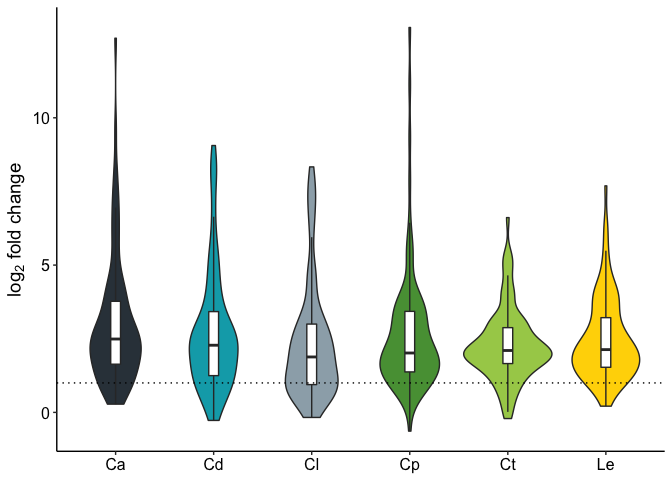
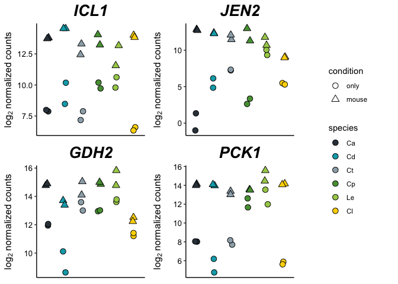

Identification of core responses
================

We wished to determine which genes showed conserved responses across
species. To do this, we have to load in the previously generated LFC
estimates. The following code was used to generate Figure 2 in the
paper.

``` r
library("ggplot2")
library("dplyr")
library("reshape2")
library("cowplot")
library("DESeq2")
library("tximport")

combined.LFC.df <- read.table("combined_LFCs_padj.txt",header=T, sep="\t")
rownames(combined.LFC.df) <- combined.LFC.df$Ca
```

To start, we do a basic filter on the data to remove low expressed
genes. For this, we use the “baseMean” field from the DESeq2 output,
which is the mean normalized expression counts for each sample. We
require that each sample has a baseMean value of more than 10:

``` r
base.means <- combined.LFC.df[, c(grep("_baseMean", names(combined.LFC.df)))]
rownames(base.means) <- combined.LFC.df$Ca
good.genes <- rownames(base.means[apply(base.means, MARGIN=1, FUN=function(x) sum(x > 10)) == ncol(base.means),])
combined.LFC.df <- combined.LFC.df[rownames(combined.LFC.df) %in% good.genes,]
```

Now we look for core induced genes. We do this by constructing boolean
(true/false) tables for adjusted p-values \< 0.1 and fold changes \> 0.
We then combine these and use them to filter for genes that meet these
criteria in five out of six species. We identify these and then plot
their fold changes:

``` r
# Define core induced genes
padj_bool <- combined.LFC.df[,grep("_padj", names(combined.LFC.df))] < 0.1 # Filter on adjusted p-values
lfc_bool <- combined.LFC.df[,grep("_l2fc", names(combined.LFC.df))] > 0 # Filter on fold changes
total_bool <- padj_bool & lfc_bool
up_genes <- rownames(total_bool[apply(total_bool, MARGIN=1, FUN=function(x) sum(x, na.rm=T)) >= 5,])

# Extract fold changes for core induced genes:
up_FCs <- combined.LFC.df[up_genes, grep("_l2fc", names(combined.LFC.df))]
up_FCs$gene <- rownames(up_FCs)

writeLines(up_genes, con="core_induced_genes.txt", sep="\n")
write.table(combined.LFC.df[up_genes,grep("_l2fc|_padj", names(combined.LFC.df))],
            "core_induced_genes_LFCs.txt", row.names=T, quote=F, sep="\t")

# Plot fold changes
colorset <- c("#333f48", "#00a9b7", "#9cadb7", "#579d42", "#a6cd57", "#ffd600")
melt(up_FCs, id.vars="gene") %>% mutate(variable = gsub("_l2fc", "", variable)) %>%
  ggplot(aes(x=variable, y=value, fill=variable, group=variable)) +
    geom_violin() +
    scale_fill_manual(values=colorset) +
    geom_boxplot(outlier.color="NA",width=0.1, fill="white") +
    theme_classic() +
    theme(axis.title.x=element_blank(),
          axis.text=element_text(size=12, color="black"),
          axis.title.y=element_text(size=14),
          legend.position="none") +
    ylab(expression(paste(log[2], " fold change", sep=""))) +
    geom_hline(yintercept=1, linetype="dotted")
```

<!-- -->

We can do this too for core repressed genes, although there are far
fewer of these:

``` r
down_lfc_bool <- combined.LFC.df[,grep("_l2fc", names(combined.LFC.df)),] < 0
total_down_bool <- padj_bool & down_lfc_bool
down_genes <- rownames(total_down_bool[apply(total_down_bool, MARGIN=1, FUN=function(x) sum(x, na.rm=T)) >= 5,])
print(combined.LFC.df[down_genes, grep("_l2fc", names(combined.LFC.df))])
```

    ##              Ca_l2fc     Cd_l2fc    Cl_l2fc    Cp_l2fc    Ct_l2fc   Le_l2fc
    ## CR_00680W -0.6588283 -0.50992945 -0.4122378 -0.8086221 -0.9855560 -1.196191
    ## C1_13060C -0.5369390 -0.17018080 -0.3095000 -1.1801960 -1.3495760 -2.097849
    ## C2_00070C -0.8584316 -0.21544465 -0.2470535 -1.2571344 -0.9448349 -1.738978
    ## C1_05500W -0.8030423 -0.06005412 -0.3904011 -0.5500112 -1.1740820 -0.952480
    ## C3_02350W -0.9133699 -0.67854496 -0.3040334 -0.9186130 -1.1656129 -1.872972
    ## C3_00330W -0.5101500 -0.26855214 -0.2921864 -0.9817438 -1.1147995 -1.224931
    ## CR_06480C -1.0544859 -0.34115255 -0.4314276 -1.6887436 -1.4562834 -2.043083

Finally, we would like to plot a few individual genes in the core
induced set. This involves a bit of code as we work from the plotCounts
function in DESeq2, and so need to import data into DESeq2:

``` r
# Here is the function we used for generating plots for the manuscript:
plotCountsPub <- function(dds,gene,gene.name, transform=F) {
  colorset <- c("#333f48", "#00a9b7", "#9cadb7", "#579d42", "#a6cd57", "#ffd600")
  plt <- plotCounts(dds,gene,intgroup=c("condition","species"),returnData=T, transform=T)
  if (transform == TRUE) plt$count <- log2(plt$count)
  plt$species <- factor(plt$species, levels=c("Ca","Cd","Ct","Cp","Le","Cl"))
  return(
    ggplot(plt,aes(x=species,y=count,fill=species,shape=condition))+
      geom_point(position=position_jitter(w=0.1,h=0),size=3, color="black")+
      scale_shape_manual(values=c(21,24)) +
      guides(fill = guide_legend(override.aes=list(shape=21))) +
      labs(title=gene.name,
           y=expression(paste(log[2]," normalized counts"))) +
      theme_classic() +
      theme(axis.title.x=element_blank(), axis.text.x=element_blank(), axis.ticks.x = element_blank()) +
      theme(plot.title=element_text(size=20, face="bold.italic", hjust=0.5),axis.title.y=element_text(size=12), axis.text.y=element_text(color="black", size=10)) +
      scale_fill_manual(values=colorset)
  )
}

# Import information on samples
sample.table <- read.table("candida_sample_information.txt",sep="\t",header=T)
rownames(sample.table) <- sample.table$sample_ID
sample.table$condition <- relevel(sample.table$condition, "only")
files <- file.path("shared_quant_sfs", paste(rownames(sample.table), "_quant.shared.sf", sep=""))
names(files) <- rownames(sample.table)
tx2gene <- read.table("tx2gene.txt", header=T, sep="\t")
txi <- tximport(files, type="salmon", tx2gene=tx2gene)
dds <- DESeqDataSetFromTximport(txi, sample.table, ~condition + species)
dds <- DESeq(dds)

ICL1 <- plotCountsPub(dds, "C1_04500W", "ICL1", transform=TRUE) + theme(legend.position="none")
GDH2 <- plotCountsPub(dds, "C2_07900W", "GDH2", transform=TRUE) + theme(legend.position="none")
JEN2 <- plotCountsPub(dds, "C4_04030W", "JEN2", transform=TRUE) + theme(legend.position="none")
PCK1 <- plotCountsPub(dds, "CR_00200W", "PCK1", transform=TRUE) + theme(legend.position="none")
plot_legend <- get_legend(plotCountsPub(dds, "C1_04500W", "ICL1", transform=TRUE))
plot_grid(plot_grid(ICL1, JEN2, GDH2, PCK1, ncol=2, align="hv"), plot_legend, ncol=2, rel_widths=c(3,1))
```

<!-- -->
