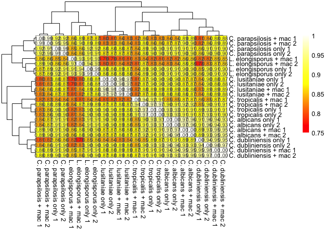

Estimating counts across species
================

While we can estimate fold changes of genes for each species
independently, in practice, if we want to do direct comparison of
abundance levels across species, we would like to be able to import them
together into DESeq2. However, there are a number of important
considerations before we can do this:

1.  We must be able to trace orthologs across species
2.  Different species have different gene content, with only some genes
    being conserved across all species
3.  Gene sequences differ across species, which could confound relative
    abundance estimation

Fortunately, as we are comparing within the CUG clade of Candida
species, we can get ortholog mappings across species using ortholog data
from the [Candida Gene Order Browser](http://cgob3.ucd.ie/). We then
have to construct new quant.sf (Salmon counts output) files that contain
all genes that are conserved across features.

Finally, to handle the differences in sequence content, we can take a
couple of mitigating steps. First of all, we have used Salmon with the
GC and sequencing bias flags to try to account for differences in
sequence content on PCR efficiency, for example. Secondly, we can treat
orthologs of a given gene as different transcripts, feeding these into
tximport so that DESeq2 corrects for differences in effective transcript
length.

### Generating shared counts files

First, we need to generate files that contain the conserved orthologs
from each species. We need to load in annotations from CGOB to do so (I
have lightly edited the annotations file and included it here):

``` r
species.list <- c("Ca","Cd","Cl","Cp","Ct","Le")
CGOB <- read.table("~/Documents/RNAseq/Candida/candida_reanalysis/final_analysis/CGOB_headed.txt",
                   sep="\t",header=T, na.strings="---", quote = "")
CGOB <- CGOB[, species.list] # Select only columns with species of interest
CGOB <- na.omit(CGOB) # Removes any lines with NA values i.e. non-conserved genes
print(head(CGOB))
```

    ##             Ca         Cd         Cl           Cp         Ct         Le
    ## 2   orf19.3293 CD36_00990 CLUG_00022 CPAR2_110100 CTRG_04406 LELG_01381
    ## 14   orf19.998 CD36_09910 CLUG_00230 CPAR2_804080 CTRG_03306 LELG_00322
    ## 80  orf19.1832 CD36_09940 CLUG_00702 CPAR2_201790 CTRG_03293 LELG_03514
    ## 91  orf19.1833 CD36_09950 CLUG_05058 CPAR2_212590 CTRG_03289 LELG_01058
    ## 102 orf19.1834 CD36_09960 CLUG_05059 CPAR2_212580 CTRG_03288 LELG_01059
    ## 113 orf19.3294 CD36_01000 CLUG_00023 CPAR2_110110 CTRG_04407 LELG_05601

There is a small issue, namely that the *C. albicans* gene IDs are in
their old Assembly 19 format. We need to correct this to the Assembly 22
IDs that were used for the alignment.

``` r
names(CGOB)[names(CGOB) == "Ca"] <- "Ca_orf19" # This is because I'm going to use the header Ca for Assembly 22 IDs

# Provide assembly 22 to ORF19 conversion 
A22_to_orf19 <- read.table("A22_to_orf19.txt", sep="\t",header=T) # Conversion table downloaded from http://candidagenome.org/
CGOB <- merge(CGOB,A22_to_orf19[,c("ORF19_ID","ASSEMBLY22_ID")],by.x="Ca_orf19",by.y="ORF19_ID",all.x=F,all.y=F)
names(CGOB)[names(CGOB) == "ASSEMBLY22_ID"] <- "Ca"

# Strip off the "_A" suffix - note that there are no "_B"-suffixed alleles in the A22 to orf19 conversion set.
# The orf19 IDs refer to a haploid genome, so the conversion uses only the "_A" allele of the diploid Assembly 22.
CGOB$Ca <- gsub("_A", "", CGOB$Ca)

CGOB$Cd <- gsub("CD36", "Cd36", CGOB$Cd) # This is another minor formatting correction for C. dubliniensis IDs

print(head(CGOB))
```

    ##     Ca_orf19         Cd         Cl           Cp         Ct         Le        Ca
    ## 1  orf19.100 Cd36_61100 CLUG_04650 CPAR2_603220 CTRG_02964 LELG_04688 C6_00980C
    ## 2 orf19.1007 Cd36_30620 CLUG_04539 CPAR2_203290 CTRG_00565 LELG_03460 CR_05260C
    ## 3  orf19.101 Cd36_61080 CLUG_04653 CPAR2_603190 CTRG_02965 LELG_04685 C6_00990W
    ## 4 orf19.1010 Cd36_30630 CLUG_04540 CPAR2_203110 CTRG_00566 LELG_03459 CR_05290W
    ## 5 orf19.1012 Cd36_30650 CLUG_04542 CPAR2_203120 CTRG_00568 LELG_03458 CR_05310W
    ## 6  orf19.102 Cd36_61070 CLUG_04652 CPAR2_603200 CTRG_02966 LELG_04686 C6_01000C

Now we’re ready to start building a list of all orthologs across all
species. The first step is to populate a data frame using gene IDs taken
from the quant.sf (Salmon output) files. For each species, we use the
"\_only\_1" file i.e. *Candida*-only, replicate 1. This is, of course,
arbitrary. We extract the gene IDs, strip off the "\_A“/”\_B"
allele-specific suffixes for *C. albicans*, and extract information on
gene ID and transcript length. We then use the CGOB file to assign the
gene ID as the *C. albicans* ID (for all species), and the transcript ID
as the species-specific gene ID. This is for tximport downstream.

``` r
dir <- "salmon_outputs"
sf.df <- data.frame(tx=character(), species=character(), gene=character(), Length=character(), EffectiveLength=character()) # Make a blank data frame

for (species in species.list) {
  sf.file <- read.table(paste(dir, "/", species, "_only_1/quant.no_mouse.sf", sep=""),
                        header=T, sep="\t")
  species.df <- data.frame(tx=sf.file$Name, species=species, Length=sf.file$Length, EffectiveLength=sf.file$EffectiveLength)
  if (species == "Ca") {
    species.df$gene <- gsub("_A|_B", "", species.df$tx)
  } else {
    species.df <- merge(species.df, CGOB[,c("Ca", species)], by.x="tx", by.y=species)
    names(species.df)[names(species.df) == "Ca"] <- "gene"
  }
  sf.df <- rbind(sf.df, species.df)
}
```

Finally, filter to get only those genes that are included in the
original CGOB data frame, and where the gene is included in all species:

``` r
# Look for those with gene IDs in CGOB
sf.df <- sf.df[sf.df$gene %in% CGOB$Ca,]

# Look for those genes that have all species present
species.count <- aggregate(sf.df$species,by=list(sf.df$gene),function(x) length(unique(x)))
shared.genes <- species.count$Group.1[species.count$x == length(species.list)]
sf.df <- sf.df[sf.df$gene %in% shared.genes,]

print(head(sf.df))
```

    ##             tx species Length EffectiveLength      gene
    ## 7  C1_00070W_A      Ca   1089        1244.356 C1_00070W
    ## 8  C1_00080C_A      Ca    852        1006.879 C1_00080C
    ## 10 C1_00100C_A      Ca    729         615.936 C1_00100C
    ## 11 C1_00110W_A      Ca   1623        1973.553 C1_00110W
    ## 12 C1_00120C_A      Ca    681         671.827 C1_00120C
    ## 13 C1_00130C_A      Ca   2100        2353.109 C1_00130C

The final step is to build a shared quant.sf file for each sample. Each
file will contain the orthologs for all species as different transcripts
from the same gene, except all orthologs for species other than that of
the sample will have zero expression. This approach allows us to import
samples from all species into DESeq2 together, while still using
tximport correction for effective transcript length.

``` r
out.dir <- "shared_quant_sfs/"

# Import information on samples
sample.table <- read.table("candida_sample_information.txt",sep="\t",header=T)
sample.table <- sample.table[sample.table$species %in% species.list,]
rownames(sample.table) <- sample.table$sample_ID

# Iterate over all samples
for (ID in sample.table$sample_ID) {
  species <- as.character(sample.table[ID,"species"])
  sample.file <- read.table(paste(dir, ID, "quant.no_mouse.sf", sep="/"), header=T, sep="\t")
  
  # First remove any rows belonging to the same species that aren't in the shared gene set
  sample.file <- sample.file[sample.file$Name %in% sf.df$tx,]
  
  # Then add any rows from other species
  # Note that this uses lengths/effective lengths from the "only_1" samples and sets TPM and NumReads to 0
  rest.file <- sf.df[sf.df$species != species, c("tx", "Length", "EffectiveLength")]
  names(rest.file)[names(rest.file) == "tx"] <- "Name"
  rest.file$TPM <- 0.0
  rest.file$NumReads <- 0.0
  sample.file <- rbind(sample.file, rest.file)
  sample.file <- sample.file[match(sf.df$tx, sample.file$Name),] # Sorts so that it is the same order as the tx2gene data frame
  # Now finally, print the file
  write.table(sample.file,
              paste(out.dir,
              ID, "_quant.shared.sf", sep=""), row.names=F, quote=F, sep="\t")
}

# Print also a tx2gene file (for use with tximport)
tx2gene <- sf.df[, c("tx", "gene")]
write.table(tx2gene, "tx2gene.txt",
            row.names=F, quote=F, sep="\t")
```

### Getting normalized counts across all species

Having used CGOB to map orthologs across all species and generate counts
files that allow import while treating orthologs as transcriptional
isoforms, we then want to get these into DESeq2.

We do this via tximport, then use the regularized log transformation of
the counts:

``` r
library("DESeq2")
library("tximport")

# Get file names
files <- file.path(out.dir, paste(rownames(sample.table), "_quant.shared.sf", sep=""))
names(files) <- rownames(sample.table)

# Now do tximport
txi <- tximport(files, type="salmon", tx2gene=tx2gene)

# Now DESeq
dds <- DESeqDataSetFromTximport(txi, sample.table, ~condition + species)
dds <- DESeq(dds)
rlg <- assay(rlog(dds))

write.table(rlg, "all_rlog_counts.txt", sep="\t", quote=F)
```

Now, finally, let’s see the correlation between samples (Fig. S1A in the
paper):

``` r
library("pheatmap")
```

    ## Warning: package 'pheatmap' was built under R version 3.5.2

``` r
# Edit sample labels
colnames(rlg) <- gsub("_", " ", colnames(rlg))
colnames(rlg) <- gsub("mouse", "+ mac", colnames(rlg))
colnames(rlg) <- gsub("Ca", "C. albicans", colnames(rlg))
colnames(rlg) <- gsub("Cd", "C. dubliniensis", colnames(rlg))
colnames(rlg) <- gsub("Ct", "C. tropicalis", colnames(rlg))
colnames(rlg) <- gsub("Cp", "C. parapsilosis", colnames(rlg))
colnames(rlg) <- gsub("Le", "L. elongisporus", colnames(rlg))
colnames(rlg) <- gsub("Cl", "C. lusitaniae", colnames(rlg))

corrs <- cor(rlg, method="spearman")
corr.dists <- as.dist(1 - corrs)
colors <- colorRampPalette(c("red", "yellow","white"))(100)
pheatmap(corrs, breaks=seq(from=0.75,to=1,length=100),
         clustering_distance_rows=corr.dists,
         clustering_distance_cols=corr.dists,
         col=colors, display_numbers = T)
```



This shows strong correlation across all samples, and especially between
replicates.
