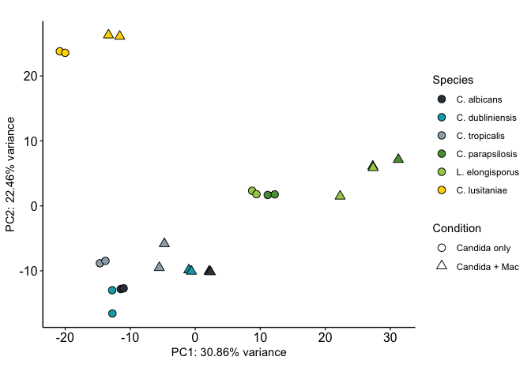
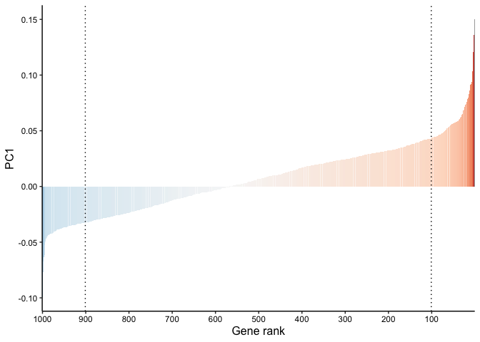
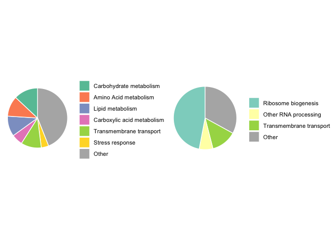

Principal component analysis
================

Having generated log-transformed abundance estimates for orthologs
across species, we performed principal component analysis of the data.
The code below was used to produce Figure 1 in the paper.

First we load in the data and select the most variable genes for
analysis:

``` r
library("ggplot2")
library("matrixStats")
library("cowplot")
library("RColorBrewer")

rlg <- as.matrix(read.table("all_rlog_counts.txt", header=T, sep="\t"))

# Select the most variable genes
ngenes <- 1000
rv <- rowVars(rlg)
select <- order(rv, decreasing = TRUE)[seq_len(min(ngenes, length(rv)))]
```

Now we do the analysis:

``` r
# Set color scale for the analysis
colorset <- c("#333f48", "#00a9b7", "#9cadb7", "#579d42", "#a6cd57", "#ffd600")

pca <- prcomp(t(rlg[select,]), center=T, scale=F)
pca.data <- as.data.frame(pca$x)
percentVar <- pca$sdev^2/sum(pca$sdev^2)
pca.data$Species <- gsub("_.*_.*", "", rownames(pca.data))
pca.data$Species <- factor(pca.data$Species, levels=c("Ca","Cd","Ct","Cp","Le","Cl"))
pca.data$Condition <- factor(gsub(".*_","",gsub("_[12]", "", rownames(pca.data))), levels=c("only", "mouse"))
ggplot(pca.data,aes(x=pca.data[,1],y=pca.data[,2],fill=Species, shape=Condition)) +
  geom_point(size=3) +
  xlab(paste0("PC", 1, ": ", round(percentVar[1]*100,digits=2), "% variance")) + 
  ylab(paste0("PC", 2, ": ", round(percentVar[2]*100,digits=2), "% variance")) +
  scale_shape_manual(values=c(21,24), labels=c("Candida only", "Candida + Mac")) +
  scale_fill_manual(values=colorset, labels=c("C. albicans", "C. dubliniensis", "C. tropicalis", "C. parapsilosis", "L. elongisporus", "C. lusitaniae")) +
  guides(fill = guide_legend(override.aes=list(shape=21))) +
  theme_classic() +
  theme(axis.text=element_text(size=12, color="black")) +
  coord_fixed()
```

<!-- -->

Note the conserved shift positively along PC1 (and to lesser extend
negatively along PC2) observed in each species. In order to identify the
genes contributing most strongly to this shift, we next want to extract
the loadings:

``` r
# Extract loadings from the data
loadings <- as.data.frame(pca$rotation)
loadings$gene_id <- rownames(loadings)
loadings <- loadings[order(loadings$PC1),]
loadings$gene_id <- factor(loadings$gene_id, levels=loadings$gene_id)

# Plot loadings
ggplot(loadings, aes(x=gene_id, y=PC1, fill=PC1)) +
  geom_bar(stat="identity") +
  scale_x_discrete("Gene rank", breaks=rownames(loadings)[seq(1, ngenes, 100)], labels=factor(seq(ngenes,1, -100))) +
  scale_fill_distiller(palette="RdBu", limits=c(-0.15, 0.15)) +
  geom_vline(xintercept=900, linetype="dotted") +
  geom_vline(xintercept=100, linetype="dotted") +
  theme_classic() +
  theme(legend.position="none", axis.text=element_text(color="black"), axis.title=element_text(size=12))
```

<!-- -->

We then want to see which genes have the strongest loadings. For this,
we extracted the 100 genes with the most positive and most negative
loadings and identified their functions. The breakdown of these
suggested strong positive contributions from metabolism and
stress-related genes, and negative contributions related to ribosome
biogenesis and gene expression:

``` r
PC1_up_names <-c("Carbohydrate metabolism", "Amino Acid metabolism", "Lipid metabolism", "Carboxylic acid metabolism", "Transmembrane transport", "Stress response", "Other")
PC1_up <- data.frame(labels=factor(PC1_up_names, levels=PC1_up_names),
                     values=c(13, 11, 11, 6, 11, 4, 44))
colours_up <- brewer.pal(n = 8, name = "Set2")[-7]
plt_up <- ggplot(PC1_up, aes(x="", y=values, fill=labels)) +
  geom_bar(stat="identity", width=1, color="white") +
  coord_polar("y", start=0) +
  theme_void() +
  scale_fill_manual(values=colours_up) +
  theme(legend.title=element_blank())

colours_down <- brewer.pal(n=4, name="Set3")
colours_down[3] <- colours_up[5]
colours_down[4] <- colours_up[7]
PC1_down_names <- c("Ribosome biogenesis", "Other RNA processing","Transmembrane transport", "Other")
PC1_down <- data.frame(labels=factor(PC1_down_names, levels=PC1_down_names),
                       values=c(47, 7, 13, 33))

plt_down <- ggplot(PC1_down, aes(x="", y=values, fill=labels)) +
  geom_bar(stat="identity", width=1, color="white") +
  coord_polar("y", start=0) +
  theme_void() +
  scale_fill_manual(values=colours_down) +
  theme(legend.title=element_blank())

plot_grid(plt_up, plt_down, ncol=2)
```

<!-- -->
