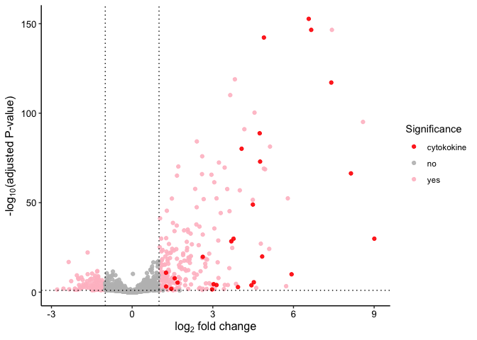
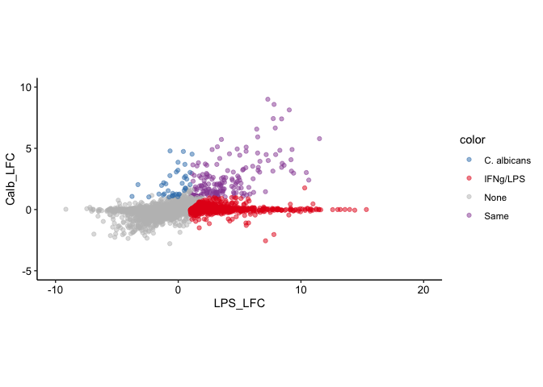
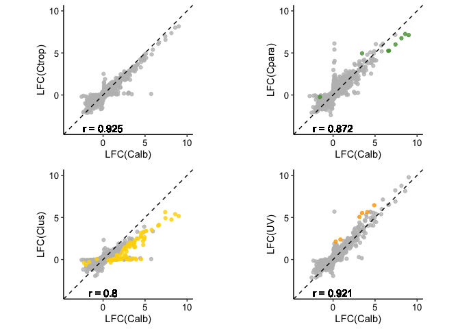

Macrophage responses to *Candida*
================

We wanted to investigate macrophage responses to different *Candida*
species. Below is the code used do this, as presented in Figure 8 of the
paper.

First we import gene-level count files from the RSEM output and build a
sample table based on these. Next we import counts into DESeq2 via
tximport:

``` r
library("tximport")
library("DESeq2")
library("ggplot2")
library("reshape2")
library("cowplot")

# Build sample table file
dir <- "gene_counts/"
suffix <- ".genes.results.mouse"
files <- list.files(dir)
samples <- gsub(suffix, "", files)
full_files <- file.path(dir, files)
names(full_files) <- samples
sampleTable <- data.frame(condition=gsub("_\\d","",samples),mouse=gsub("[A-Za-z0-9]+_","",samples),
                          file=full_files, row.names=samples)
sampleTable$condition <- relevel(sampleTable$condition, "BMDM")

# Import data into DESeq2
txi <- tximport(full_files, type="rsem", txIn=FALSE, txOut=FALSE)
txi$length[txi$length == 0] <- 1
dds <- DESeqDataSetFromTximport(txi, sampleTable, ~condition)
dds <- DESeq(dds)
```

We start by comparing macrophage transcriptomes in response to *C.
albicans* to medium only. In the paper we highlight in particular the
role of chemokine and cytokine genes. In practice, we found these by
taking the list of *C. albicans*-induced genes, using
(DAVID)\[<https://david.ncifcrf.gov/>\] to identify functional
groupings, then re-importing these as a text file. We then use these to
highlight cytokine/chemokine genes in the volcano plot:

``` r
# Do differential expression analysis with LFC shrinkage
res_Calb <- lfcShrink(dds, "condition_Calb_vs_BMDM", type="apeglm")

# Prepare data for a volcano plot
res_df <- as.data.frame(na.omit(res_Calb))
res_df$nlogP <- -log10(res_df$padj) # -log10 transformed P-values
res_df$sig <- ifelse(abs(res_df$log2FoldChange) > 1 & res_df$nlogP > 1, "yes", "no") # Indicator of whether a gene is significantly differentially expressed with FDR = 0.1 and LFC threshold of 1
#res_df$mlogP[res_df$mlogP > 20] <- 20

# Import induced cytokine genes
cytokines <- read.table("cytokine_Calb_induced.txt", header=T, sep="\t")
cytokine.genes <- rownames(cytokines)

res_df$sig[rownames(res_df) %in% cytokine.genes] <- "cytokokine" # Mark induced cytokine genes
res_df <- res_df[order(res_df$sig, decreasing = T),]

ggplot(res_df, aes(x=log2FoldChange, y=nlogP, color=sig)) +
  geom_point(alpha=0.9) +
  scale_color_manual(values=c("red", "grey", "pink")) +
  theme_classic() +
  theme(axis.title=element_text(size=12), axis.text=element_text(size=10, color="black")) +
  labs(y=expression(paste("-", log[10], "(adjusted P-value)")),
       x=expression(paste(log[2], " fold change")), color="Significance") +
  geom_hline(yintercept = 1, linetype="dotted") +
  geom_vline(xintercept = -1, linetype="dotted") +
  geom_vline(xintercept = 1, linetype="dotted")
```

<!-- -->

This shows strong induction of numerous pro-inflammatory genes,
including in particular several cytokine and chemokine genes among the
most strongly induced.

Next we compare the *C. albicans*-induced response to the response of
classically activated (M1) macrophages (IFNg/LPS-stimulated), as in
Figure S6A. For this, we need the pairwise comparison of
IFNg/LPS-stimulated and unstimulated macrophages, as well as comparing
the two stimulated conditions. The latter requires producing a new DESeq
object that has *C. albicans* as the base level factor instead of
medium:

``` r
# Get comparison vs unstimulated
res_LPS <- na.omit(lfcShrink(dds, coef="condition_LPS_vs_BMDM", type="apeglm")) # get IFNg/LPS vs medium
up_Calb <- rownames(res_Calb)[res_Calb$padj < 0.1 & res_Calb$log2FoldChange > 1]
up_LPS <- rownames(res_LPS)[res_LPS$padj < 0.1 & res_LPS$log2FoldChange > 1]

# Get new DESeq object with C. albicans as the base factor
sampleTable$condition <- relevel(sampleTable$condition, "Calb")
dds_Calb <- DESeqDataSetFromTximport(txi, sampleTable, ~condition)
dds_Calb <- DESeq(dds_Calb)

# Use this to directly compare expression levels in C. albicans-stimulated and IFNg/LPS-stimulated
res_LPS_Calb <- na.omit(lfcShrink(dds_Calb, coef="condition_LPS_vs_Calb", type="apeglm"))
res_LPS_Calb <- as.data.frame(res_LPS_Calb)
up_LPS_Calb  <- rownames(res_LPS_Calb)[res_LPS_Calb$log2FoldChange > 1 & res_LPS_Calb$padj < 0.1]
up_Calb_LPS <- rownames(res_LPS_Calb)[res_LPS_Calb$log2FoldChange < -1 & res_LPS_Calb$padj < 0.1]

# Define intersections and differences between these groups
up_both_same <- intersect(up_Calb, up_LPS)
up_Calb_higher <- setdiff(intersect(up_Calb, up_Calb_LPS), up_LPS)
up_LPS_higher <- setdiff(intersect(up_LPS, up_LPS_Calb), up_Calb)

# Now make a merged data frame with LFCs from both for plotting
comparison <- as.data.frame(res_LPS)[,c("log2FoldChange", "padj")]
names(comparison) <- c("LPS_LFC", "LPS_padj")
comparison$gene <- rownames(comparison)
Calb <- as.data.frame(res_Calb)[,c("log2FoldChange", "padj")]
names(Calb) <- c("Calb_LFC", "Calb_padj")
Calb$gene <- rownames(Calb)
comparison <- merge(comparison, Calb, by="gene")
comparison <- na.omit(comparison)

comparison$color <- "None"
comparison$color[comparison$gene %in% up_both_same] <- "Same"
comparison$color[comparison$gene %in% up_Calb_higher] <- "C. albicans"
comparison$color[comparison$gene %in% up_LPS_higher] <- "IFNg/LPS"
cols <- c("#377EB8", "#E41A1C", "grey", "#984EA3")

comparison <- comparison[ order(comparison$color, decreasing=T),]

ggplot(comparison, aes(x=LPS_LFC, y=Calb_LFC, color=color)) +
  geom_point(alpha=0.5) +
  xlim(-10, 20) + ylim(-5, 10) +
  theme_classic() +
  coord_fixed() +
  scale_color_manual(values=cols) +
  theme(axis.text=element_text(size=10, color="black"))
```

    ## Warning: Removed 1 rows containing missing values (geom_point).

<!-- -->

This shows overlap in responses, but a much broader, stronger response
to IFNg/LPS with only a few genes uniquely induced in response to *C.
albicans*. Finally, let’s compare to UV-killed *C. albicans* and other
*Candida* species:

``` r
plot_vs_albicans <- function(condition, color) {
  # Get pairwise comparisons
  res_vs_medium <- na.omit(lfcShrink(dds, coef=paste("condition", condition, "vs_BMDM", sep="_"), type="apeglm"))
  res_vs_Calb <- na.omit(lfcShrink(dds_Calb, coef=paste("condition", condition, "vs_Calb", sep="_"), type="apeglm"))
  # Identify differences vs C. albicans
  diff_vs_Calb <- row.names(res_vs_Calb)[res_vs_Calb$padj < 0.1 & abs(res_vs_Calb$log2FoldChange) > 1]
  
  # Create a data frame for plotting
  combined_df <- merge(as.data.frame(res_Calb), as.data.frame(res_vs_medium), by=0, suffixes=c("_Calb", "_other")) # Merge data
  combined_df$sig <- ifelse(combined_df$Row.names %in% diff_vs_Calb, "yes", "no") # Mark significant differences
  combined_df <- combined_df[order(combined_df$sig),]
  correlation <- cor(combined_df$log2FoldChange_Calb, combined_df$log2FoldChange_other, method="pearson")
  
  # Plot
  return(ggplot(combined_df, aes(x=log2FoldChange_Calb, y=log2FoldChange_other, color=sig)) +
    geom_point(alpha=0.8) +
    xlim(-4, 10) + ylim(-4, 10) +
    geom_abline(slope=1, linetype="dashed") +
    geom_text(mapping=aes(x=0, y=-4, label=paste("r =", signif(correlation, 3))), color="black") +
    coord_fixed() +
    theme_classic() +
    theme(axis.text=element_text(size=10, color="black"),
          legend.position="none") +
    scale_color_manual(values=c("grey", color)) +
    labs(x = "LFC(Calb)", y = paste("LFC(", condition, ")", sep="")))
}

color_set <- c("#9cadb7", "#579d42", "#ffd600", "#FFA500")
names(color_set) <- c("Ctrop", "Cpara", "Clus", "UV")
plot_list <- lapply(c("Ctrop", "Cpara", "Clus", "UV"), function(x) plot_vs_albicans(x, unname(color_set[x])))
plot_grid(plotlist=plot_list, ncol=2)
```

<!-- -->

Evidently there is a high degree of correlation between all responses,
with only *C. lusitaniae* inducing a broadly weaker response in
comparison to *C. albicans*.
